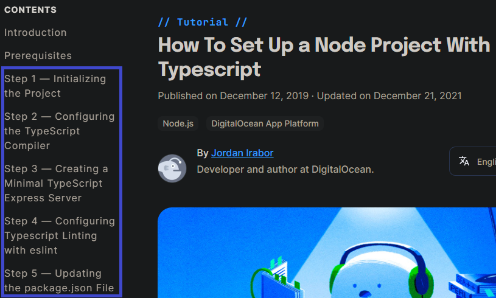

# What is TypeScript ? :nerd_face:  

#### TypeScript is  

  

* an object-oriented programming language developed and maintained by Microsoft
* a superset of JavaScript and contains all of its elements
* built on javascript even though it uses the .ts extenson instead of the .js extension
* easily compiled to plain javascript via a TypeScript compiler
  

<br/>

# Why consider TypeScript ? :thinking:

* **Static typing** makes large scale applications more robust and less prone to bugs
* **OOP concepts** such as Classes, Interfaces, Inheritance etc are supported
* Many **frameworks** support TypeScript so it is easy to adopt it for your development

<br/>

## Static Typing

TypeScript restricts the mixing of data types. Errors would be thrown if the restrictions are violated.

### Basic types

Primitive types such as *boolean*, *float*, *integer* and *string* can be declared and type checked at compile time

```typescript

let isTeacher: boolean = true;
let salary: number = 90000;
let name: string = "Zac";

isStudent = false;         // ok
salary = "one million";   // number type assigned to string will have error
name = 888;               // string type assigned to number will have error  

```

### Array & Tuple
Likewise, *array* & *tuple* can be type checked

```typescript
let ages: number[] = [32, 45, 57];                // array can be declared this way
let joined: Array<number> = [2020, 2013, 2009];   // array can also be declared this way

let graduated:[string, number];                   // tuple allows elements of different types
graduated = ["sep", 2008];                        // ok
graduated = [2007, 2008];                         // this will have error
```

### Any type
There are times where the application deals with data where the type is not available beforehand or only available during runtime  
The **any** type declaration will allow typechecking to be bypassed  

```typescript
function getStudentRecord(id: string): any;    // example of a function declaration
let record1 = getStudentRecord("P1001");       // this invocation is ok
let record2 = getStudentRecord(1001);          // this invocation will have error
```
From the declaration it is clear to see that the function expects a parameter id of type *string* and will return a value of type *any*  
While this allows opt-out checking grants convenience, type-safety is not enforced.

### Other types
There are other types such as void, undefined, unknown, null, never  
For a more in-depth understanding of types and subtlties, refer to
??????????????????????????????????????????????

<br/>

## OOP Features
Custom types can be defined to meet your own needs via OOP features like interfaces and classes  
The variables of these types are also type checked  

### Interface
```javascript
interface Teacher {
    name: string;
    isFulltime: boolean;
    email?: string;
}
let teacher: Teacher;
teacher = {name:'Amy', isFullTime: true};   // this is ok even without email
```
The *?* makes the email property optional so the teacher variable can be assigned either with or without it

### Class

```typescript

class Student {
    public fullname: string;                                // A public property
    private householdIncome: number;                        // A private property

    constructor(studentName: string, income: number) {
        this.fullname = studentName;
        this.householdIncome = income;
    }

    public getHouseholdIncome(): number {
        return this.householdIncome;
    }
}

let newStudent:Student = new Employee('Danny', 5000);       // instantiate with constructor
let familyIncome:number = newStudent.getHouseholdIncome();  // invocation ok
familyIncome = newStudent.householdIncome;                  // private property cannot be accessed directly so there will be error
let studentName:string = newStudent.fullname;               // public property can be accessed directly so ok  

```

Variables can be instantiated via the constructor with the **new** keyword  
Class properties can be declared with access modifiers to control accessbility  

<br/>

## Frameworks & TypeScript  

Popular **front-end** web frameworks such as *ReactJS*, *AngularJS* & *VueJS* can already be programmed using TypeScript  
The use of TypeScript is even encouraged  
<br/>


| Framework  | Documentation |
| --- | --- |
| ReactJS |   |
| AngularJS |  |
| VueJS |    |  
  
<br/>

On the **back-end**, TypeScript can be easily setup and configured in a few simple steps, as can be referenced here https://www.digitalocean.com/community/tutorials/setting-up-a-node-project-with-typescript  
It can be used together with minimal back-end frameworks like *Express* & *Koa*, or opinionated frameworks like *NestJS* & *loopback*
<p align="center">
    
</p>

 ###References  
 https://angular.io/guide/typescript-configuration  
 https://vuejs.org/guide/typescript/overview.html  
 https://reactjs.org/docs/static-type-checking.html  
 https://www.digitalocean.com/community/tutorials/setting-up-a-node-project-with-typescript  
 
