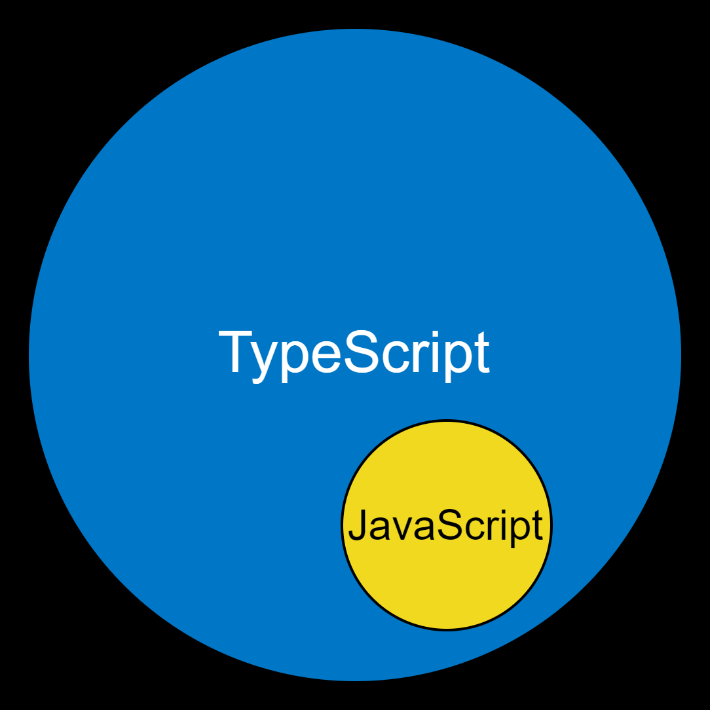
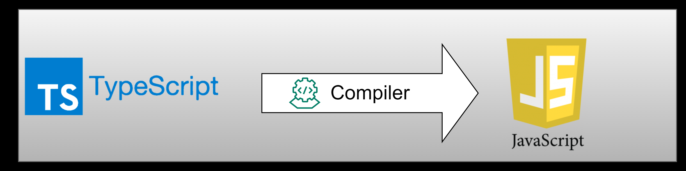
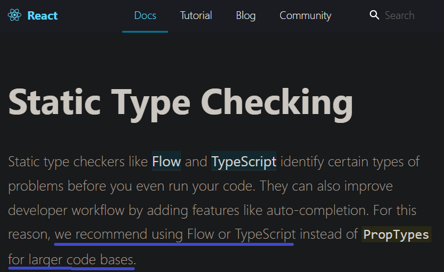
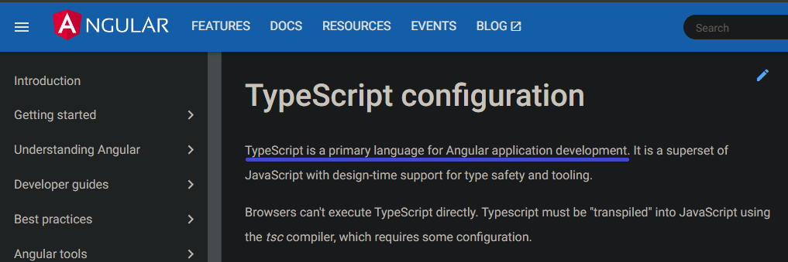
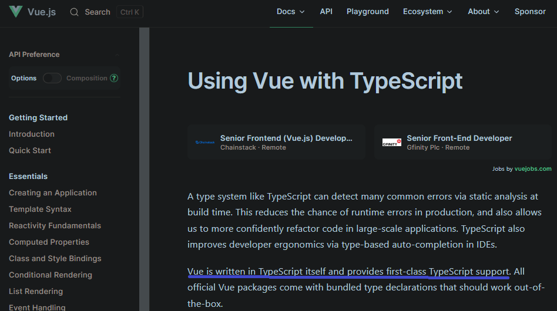
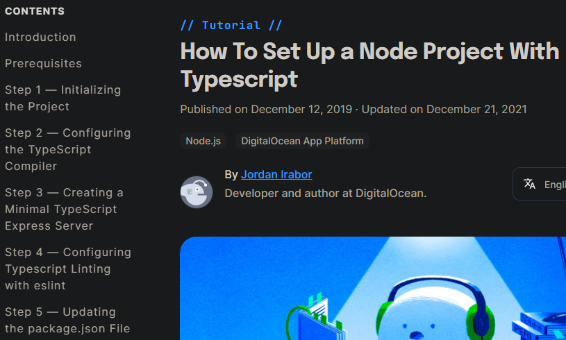

# What is TypeScript ? :nerd_face:
#### TypeScript is  

  

* an object-oriented programming language developed and maintained by Microsoft
* a superset of JavaScript and contains all of its elements
* built on javascript even though it uses the .ts extenson instead of the .js extension
* easily compiled to plain javascript via a TypeScript compiler
  

<br/>

# Why use TypeScript ? :thinking:
* Static typing makes large scale applications more robust and less prone to bugs
* OOP concepts such as Classes, Interfaces, Inheritance etc are supported
* Many frameworks support TypeScript so it is easy to adopt it for your development

<br/>

## Static Typing

### Basic types
Primitive types such as *boolean*, *float*, *integer* and *string* can be declared and type checked at compile time

```ruby
let isTeacher: boolean = true;
let salary: number = 90000;
let name: string = "Zac";

isStudent = false;         // ok
salary = "one million";   // number type assigned to string will have error
name = 888;               // string type assigned to number will have error
```

### Array & Tuple
Likewise, *array* & *tuple* can be type checked

```ruby
let ages: number[] = [32, 45, 57];                // array can be declared this way
let joined: Array<number> = [2020, 2013, 2009];   // array can also be declared this way

let graduated:[string, number];                   // tuple allows elements of different types
graduated = ["sep", 2008];                        // ok
graduated = [2007, 2008];                         // this will have error
```

### Any type
There are times where the application deals with data where the type is not available prior *eg dynamic input from the user*  
The **any** type declaration will allow typechecking to be bypassed  

```ruby
function getRecord(id: number): any;    // here we allow the return type of the function to be of any type 
```

While this allows opt-out checking grants convenience, type-safety is not enforced.

### Other types
There are other types such as void, undefined, unknown, null, never  
For a more in-depth understanding of types and subtlties, refer to
??????????????????????????????????????????????
<br/>

## OOP Support

<br/>

## Frameworks & TypeScript  

Popular **front-end** web frameworks such as *ReactJS*, *AngularJS* & *VueJS* can already be programmed using TypeScript  
The use of TypeScript is even encouraged  
<br/>


| Framework  | Documentation |
| --- | --- |
| ReactJS |   |
| AngularJS |  |
| VueJS |    |  
  
<br/>
On the **back-end**, TypeScript can be easily setup and configured in a few simple steps, as can be referenced here https://www.digitalocean.com/community/tutorials/setting-up-a-node-project-with-typescript  
<p align="center">
    
</p>
