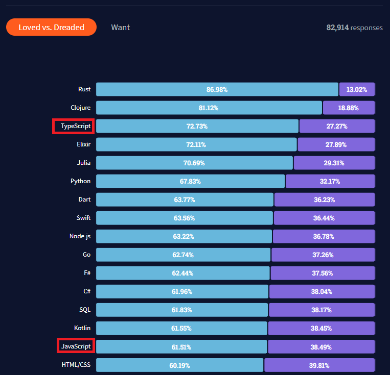
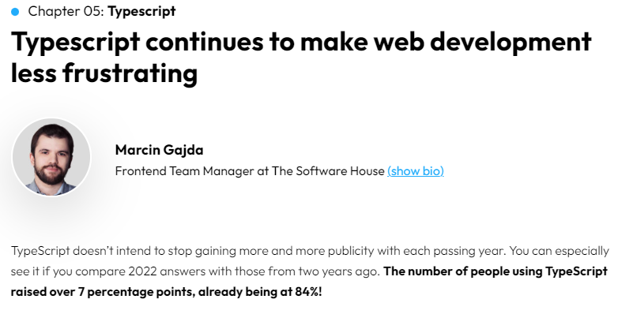
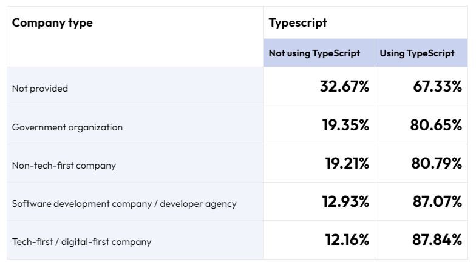
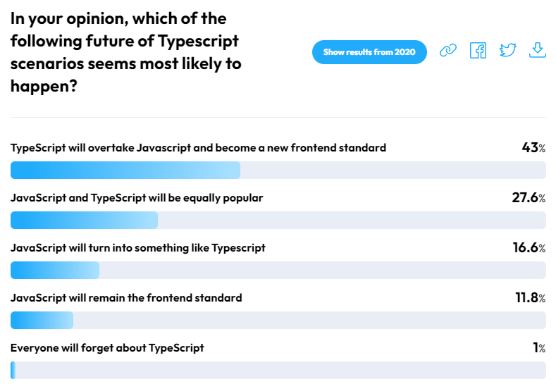
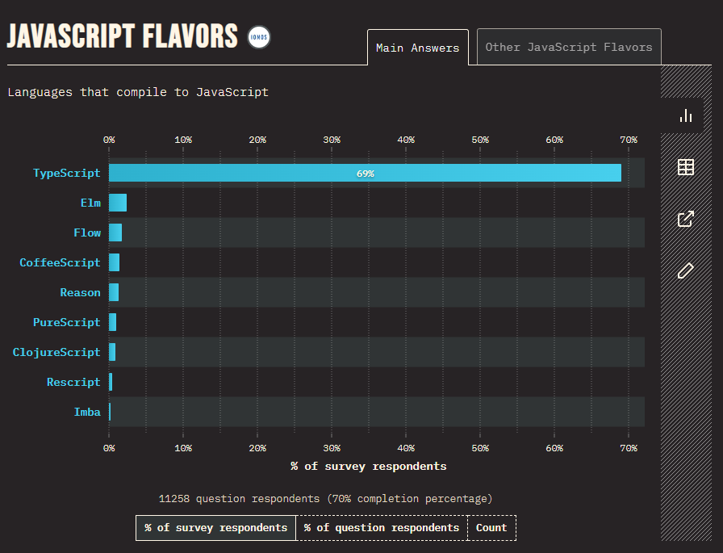

# What is TypeScript ?  

<p align="center">
      
</p> 

#### TypeScript is  

* an object-oriented programming language developed and maintained by Microsoft
* a superset of JavaScript and contains all of its elements
* built on javascript even though it uses the .ts extenson instead of the .js extension
* easily compiled to plain javascript via a TypeScript compiler  

<p align="center">
      
</p>  

<br/>

# Why consider TypeScript ?  

* **Static typing** makes large scale applications more robust and less prone to bugs.
* **OOP concepts** such as Classes, Interfaces, Inheritance etc are supported.
* Many **frameworks** support TypeScript so it is easy to adopt it for your development.

### Some Figures

<br/>

      

*Source: 2021 Developer Survey*

In the loved versus dreaded poll, TypeScript did not only rank significantly above JavaScript, it also ranked near the top among programming languages.

<p align="center">
    
    
    
</p>  

<p align="center">

|   | 
| --- |
|   |
|  |
|    |  

</p>  

*Source: State of frontend 2022*

<p align="center">
    
</p> 

*Source: State of JavaScript 2021*

<br/>

## Static Typing

TypeScript restricts the mixing of data types. Errors would be thrown if the restrictions are violated.  

<br/>

### Basic types
Primitive types such as *boolean*, *float*, *integer* and *string* can be declared and type checked at compile time.

```typescript

let isTeacher: boolean = true;
let salary: number = 90000;
let name: string = "Zac";

isStudent = false;         // ok
salary = "one million";   // number type assigned to string will have error
name = 888;               // string type assigned to number will have error  

```

<br/>

### Array & Tuple
Likewise, *array* & *tuple* can be type checked

```typescript
let ages: number[] = [32, 45, 57];                // array can be declared this way
let joined: Array<number> = [2020, 2013, 2009];   // array can also be declared this way

let graduated:[string, number];                   // tuple allows elements of different types
graduated = ["sep", 2008];                        // ok
graduated = [2007, 2008];                         // this will have error
```

<br/>

### Any type
There are times where the application deals with data where the type is not available beforehand or only available during runtime.  
The **any** type declaration will allow typechecking to be bypassed.    

```typescript
function getStudentRecord(id: string): any;    // example of a function declaration
let record1 = getStudentRecord("P1001");       // this invocation is ok
let record2 = getStudentRecord(1001);          // this invocation will have error
```
From the declaration it is clear to see that the function expects a parameter id of type *string* and will return a value of type *any*.  
While this opt-out checking grants convenience, type-safety is no longer enforced.  
The tradeoff here should be made with caution and it is recommended to define your own type eventually.  

<br/>

### Union type
Union type means it can be one of several types.
The **|** is used to define union type.
```typescript
let admissionId: string | number;       // union: expect this variable to be of either type string or number
```

<br/>

### Other types
Besides the above commonly used types, there are other pre-defined types such as void, undefined, unknown, null, never  
An in-depth documentation of the types can be referenced at the [offical website](https://www.typescriptlang.org/docs/handbook/2/everyday-types.html)

<br/>
  
## OOP Features
Custom types can be defined to meet your own needs via OOP features like interfaces and classes.  
The variables of these types are also type checked.  
  
### Interface
```javascript
interface Teacher {
    name: string;
    isFulltime: boolean;
    email?: string;
}
let teacher: Teacher;
teacher = {name:'Amy', isFullTime: true};   // this is ok even without email
```
The **?** makes the email property optional so the teacher variable can be assigned either with or without it.

<br/>

### Class

```typescript

class Student {
    public fullname: string;                                // A public property
    private householdIncome: number;                        // A private property

    constructor(studentName: string, income: number) {
        this.fullname = studentName;
        this.householdIncome = income;
    }

    public getHouseholdIncome(): number {
        return this.householdIncome;
    }
}

let newStudent:Student = new Employee('Danny', 5000);       // instantiate with constructor
let familyIncome:number = newStudent.getHouseholdIncome();  // invocation ok
familyIncome = newStudent.householdIncome;                  // private property cannot be accessed directly so there will be error
let studentName:string = newStudent.fullname;               // public property can be accessed directly so ok  

```

Variables can be instantiated via the constructor with the **new** keyword.   
Class properties can be declared with access modifiers to control accessbility.  

<br/>
  
## Frameworks & TypeScript  

### Basic Setup

<br/>

TypeScript can be easily setup and configured in a few simple steps.

```linux
npm install --save-dev typescript
```
In a nodeJS project, install the typescript npm module as a dev dependency.

<br/>

```linux
npx tsc --init
```
This creates a config file tsconfig.json that is initialized with some default options.  

<br/>

```json
{
  "compilerOptions": {
    "target": "es5",                          
    "module": "commonjs",                    
    "lib": ["es6"],                     
    "allowJs": true,
    "outDir": "build",                          
    "rootDir": "src",
    "strict": true,         
    "noImplicitAny": true,
    "esModuleInterop": true,
    "resolveJsonModule": true
  }
}
```
This is an example of the config file.  
This file defines the compiler options to transpile typescript to javascript.  
The full list of options configurable can be referenced at the [typescript website](https://www.staging-typescript.org/tsconfig)  

<br/>

### With Frameworks

```typescript
import express from 'express';
const app = express();
const port = 5000;

app.get("/", (req, res) => {
  res.send("First TypeScript Project");
});

app.listen(port, () => {
  return console.log(`Server listening at http://localhost:${port}`);
});
```
This could be .ts file to run a simple server.  

<br/>

```linux
npx tsc
```
This will compile the typescript in the .ts file to javascript. Then the server code can be run.  
More information about the setup can be referenced [here.](https://www.typescriptlang.org/download)  
A more robust setup can be referenced [here.](https://www.digitalocean.com/community/tutorials/setting-up-a-node-project-with-typescript)  

As seen above, typescript can be used together with minimal back-end frameworks like *Express* & *Koa*, or opinionated frameworks like *NestJS* & *loopback*.  

<br/>

Popular **front-end** frameworks such as *ReactJS*, *AngularJS* & *VueJS* can already be programmed using TypeScript.  
The use of TypeScript is also recommended.  
<br/>


| Framework  | Documentation |
| --- | --- |
| ReactJS |   |
| AngularJS |  |
| VueJS |    |  
  
<br/>


<!--
 ###References  
 https://angular.io/guide/typescript-configuration  
 https://vuejs.org/guide/typescript/overview.html  
 https://reactjs.org/docs/static-type-checking.html  
 https://www.digitalocean.com/community/tutorials/setting-up-a-node-project-with-typescript  
 https://insights.stackoverflow.com/survey/2021#technology-most-loved-dreaded-and-wanted  
 https://dev.to/plazarev/latest-web-development-and-javascript-trends-to-follow-in-2022-118c  
 
 
-->
 
